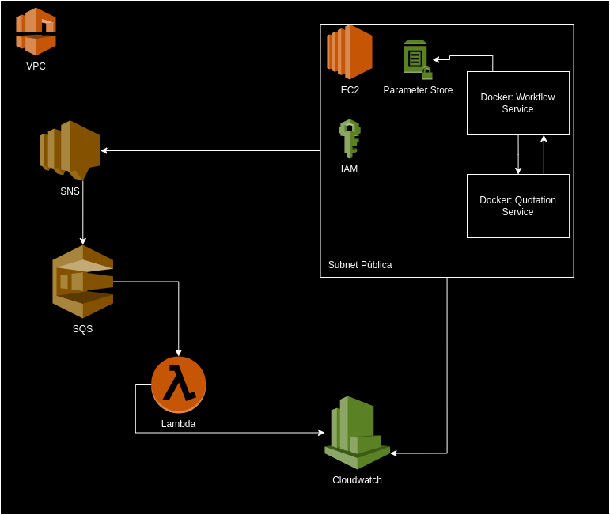
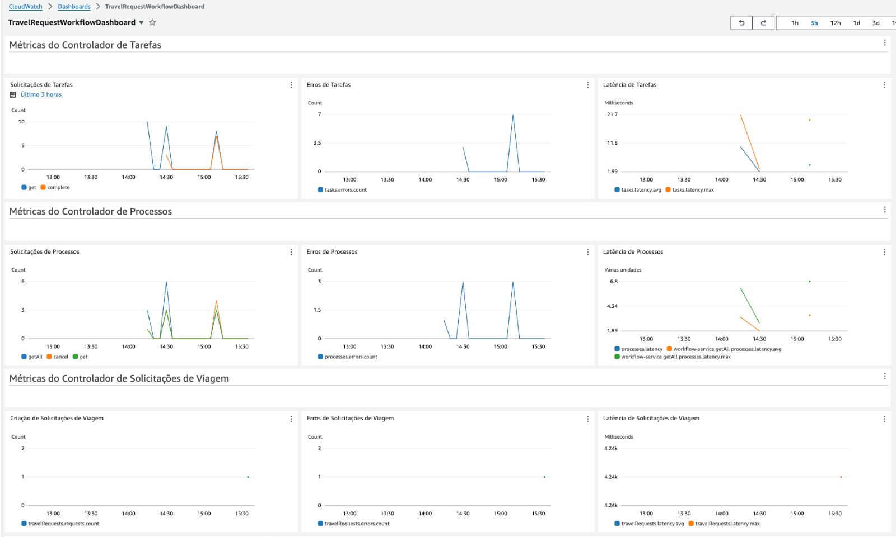
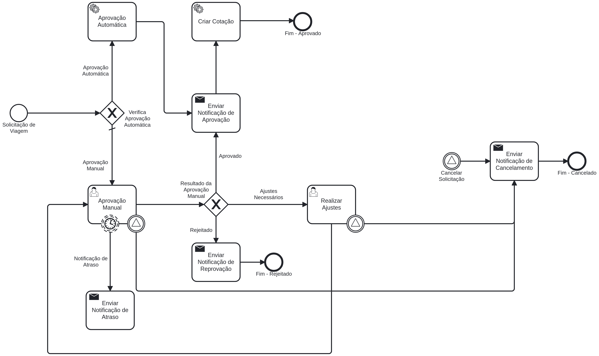

# Projeto de Solicitação de Viagem

Este projeto é uma aplicação de gerenciamento de solicitações de viagem, desenvolvida como parte de um desafio técnico. A aplicação permite que os usuários criem, aprovem e cancelem solicitações de viagem, utilizando uma combinação de Spring Boot, Camunda BPM e serviços AWS para fornecer uma solução robusta e escalável.

## Funcionalidades

- **Criação de Solicitação de Viagem**: Cria uma nova solicitação de viagem e inicia o processo de aprovação utilizando Camunda BPM.
- **Aprovação de Solicitações**: Aprovação automática ou manual das solicitações de viagem com base em regras de negócio específicas.
- **Cancelamento de Processos**: Permite o cancelamento de uma solicitação de viagem a qualquer momento do processo.
- **Gerenciamento de Tarefas**: Recupera e completa tarefas associadas a um processo de solicitação de viagem.
- **Notificações**: Envia notificações por e-mail para diferentes eventos do processo (aprovação, rejeição, necessidade de ajustes, atraso, cancelamento).

## Tecnologias Utilizadas

- **Java 22**
- **Spring Boot 3.2.5**
- **Camunda BPM 7.22.0**
- **Swagger v3 (Springdoc OpenAPI)**
- **AWS (SNS, SQS)**
- **H2 Database**

#### Arquitetura

A arquitetura da aplicação é composta por várias camadas e serviços integrados:

1. **Camunda BPM**: Utilizado para modelar e gerenciar o fluxo de trabalho das solicitações de viagem. Os processos são definidos utilizando BPMN (Business Process Model and Notation) e executados no motor de processos Camunda.

2. **Spring Boot**: Serve como o framework principal da aplicação, fornecendo APIs REST para interação com o sistema. Ele gerencia a lógica de negócio e coordena as interações com o Camunda BPM.

3. **Swagger/OpenAPI**: Utilizado para documentar e testar as APIs REST de forma interativa. A documentação das APIs ajuda no desenvolvimento e integração com outros sistemas.

4. **AWS**: A infraestrutura da aplicação é provisionada na AWS usando AWS CDK (Cloud Development Kit). Os principais componentes incluem:
    - **VPC (Virtual Private Cloud)**: Cria uma rede virtual isolada para hospedar os recursos da aplicação.
    - **EC2 (Elastic Compute Cloud)**: Instâncias de servidor que hospedam a aplicação Spring Boot e outros serviços necessários.
    - **IAM (Identity and Access Management)**: Gerencia permissões e políticas de segurança para os recursos AWS.
    - **SNS (Simple Notification Service)** e **SQS (Simple Queue Service)**: Utilizados para gerenciar mensagens e filas para processamento assíncrono.
    - **Lambda**: Funções serverless para processar eventos, como envio de notificações por e-mail.
    - **CloudWatch**: Monitora e coleta métricas da aplicação, fornecendo dashboards e alertas.

#### CDK Stack

A configuração da infraestrutura AWS é gerenciada através de AWS CDK, que define e provisiona os recursos necessários. A stack inclui a criação de uma VPC, instâncias EC2, funções Lambda para processamento de mensagens, tópicos SNS, filas SQS e dashboards CloudWatch para monitoramento.

O projeto CDK espera encontrar 2 parametros no Parameter Store na região us-east-1
`/workflow_cdk/ACCESS_KEY_AWS`  
`/workflow_cdk/SECRET_KEY_AWS`

#### Funcionamento

- **Criação de Solicitação de Viagem**: Usuários podem criar solicitações de viagem via API REST, que são processadas pelo Camunda BPM.
- **Aprovação de Solicitação**: As solicitações podem ser aprovadas automaticamente com base em regras pré-definidas ou manualmente por um usuário autorizado.
- **Notificações**: Utilizando SNS e SQS, a aplicação envia notificações de aprovação ou rejeição via e-mail, processadas por funções Lambda.

Esta arquitetura garante que a aplicação seja escalável, segura e fácil de gerenciar, proporcionando uma solução completa para o gerenciamento de solicitações de viagem.

### Componentes da Aplicação

1. **TravelRequestController**: Controlador responsável pela criação de solicitações de viagem.
2. **CamundaProcessController**: Controlador para gerenciar instâncias de processos e tarefas associadas.
3. **TaskController**: Controlador para gerenciar tarefas do processo de solicitação de viagem.
4. **Serviços de Notificação**: Serviços responsáveis por enviar notificações de aprovação, rejeição, ajustes necessários, atrasos e cancelamentos via AWS SNS.
5. **Serviços de Negócio**: Implementam a lógica de negócios, incluindo a verificação de aprovação automática e a criação de cotações.

### Infraestrutura

A infraestrutura da aplicação é configurada utilizando AWS CDK (Cloud Development Kit), que permite a definição da infraestrutura como código. Aqui estão os principais componentes:

- **VPC (Virtual Private Cloud)**: Cria uma rede virtual isolada onde os recursos da aplicação são executados.
- **Security Group**: Define regras de segurança para permitir acesso SSH e HTTP à instância EC2.
- **IAM Role**: Permissões para a instância EC2 acessar outros serviços AWS, como SNS.
- **SNS (Simple Notification Service)**: Serviço de notificação para envio de mensagens.
- **SQS (Simple Queue Service)**: Fila de mensagens para processamento assíncrono.
- **Lambda Function**: Função para processar mensagens da fila SQS e enviar e-mails.
- **EC2 Instance**: Hospeda a aplicação Spring Boot e o serviço de cotações.
- **CloudWatch Dashboard**: Monitora as métricas da aplicação e dos processos.

### Diagrama de Arquitetura

O diagrama a seguir ilustra a arquitetura da aplicação:




### Monitoramento de Métricas no CloudWatch

Este projeto utiliza o Amazon CloudWatch para monitorar diversas métricas importantes relacionadas ao funcionamento do sistema de solicitações de viagem. Abaixo, descrevemos as métricas monitoradas e como elas são configuradas no código do CDK.

#### Métricas Monitoradas

1. **Métricas de Solicitações de Viagem**
    - **Criação de Solicitações**:
        - **travelRequests.create**: Tempo decorrido para criar uma solicitação de viagem.
        - **travelRequests.requests**: Contador de solicitações de viagem criadas.
        - **travelRequests.errors**: Contador de erros ao criar solicitações de viagem.

2. **Métricas de Tarefas**
    - **Obtenção de Tarefas**:
        - **tasks.get**: Tempo decorrido para buscar as tarefas.
        - **tasks.requests**: Contador de solicitações de busca de tarefas.
        - **tasks.errors**: Contador de erros ao buscar tarefas.
    - **Obtenção de Tarefa Específica**:
        - **task.get**: Tempo decorrido para buscar uma tarefa específica.
        - **tasks.requests**: Contador de solicitações de busca de tarefa específica.
        - **tasks.errors**: Contador de erros ao buscar tarefa específica.
    - **Conclusão de Tarefas**:
        - **tasks.complete**: Tempo decorrido para completar uma tarefa.
        - **tasks.requests**: Contador de solicitações de conclusão de tarefas.
        - **tasks.errors**: Contador de erros ao completar tarefas.
    - **Latência e Disponibilidade**:
        - **tasks.get.latency**: Latência média para buscar as tarefas.
        - **tasks.get.availability**: Disponibilidade para buscar as tarefas.

3. **Métricas de Processos Camunda**
    - **Obtenção de Todas as Instâncias de Processos**:
        - **processes.getAll**: Tempo decorrido para buscar todas as instâncias de processos.
        - **processes.requests**: Contador de solicitações de busca de todas as instâncias de processos.
        - **processes.errors**: Contador de erros ao buscar todas as instâncias de processos.
    - **Obtenção de Instância de Processo Específica**:
        - **processes.get**: Tempo decorrido para buscar uma instância de processo específica.
        - **processes.requests**: Contador de solicitações de busca de instância de processo específica.
        - **processes.errors**: Contador de erros ao buscar instância de processo específica.
    - **Obtenção de Tarefas Atuais de uma Instância de Processo**:
        - **processes.getCurrentTasks**: Tempo decorrido para buscar as tarefas atuais de uma instância de processo.
        - **processes.requests**: Contador de solicitações de busca das tarefas atuais de uma instância de processo.
    - **Cancelamento de Processos**:
        - **processes.cancel**: Tempo decorrido para cancelar uma instância de processo.
        - **processes.requests**: Contador de solicitações de cancelamento de processos.
        - **processes.errors**: Contador de erros ao cancelar processos.
    - **Latência e Disponibilidade**:
        - **processes.get.latency**: Latência média para buscar as instâncias de processos.
        - **processes.get.availability**: Disponibilidade para buscar as instâncias de processos.




### Fluxo do Processo

1. **Solicitação de Viagem**: Um usuário cria uma solicitação de viagem através de uma API REST.
2. **Verificação de Aprovação Automática**: O sistema verifica se a solicitação atende aos critérios de aprovação automática.
3. **Aprovação Manual**: Se a solicitação não atende aos critérios de aprovação automática, ela é enviada para aprovação manual.
4. **Notificações**: O sistema envia notificações por e-mail para informar o solicitante sobre o status da sua solicitação (aprovada, rejeitada, ajustes necessários, atrasada, cancelada).
5. **Criação de Cotação**: Em caso de aprovação, uma cotação é criada através de uma API externa.

## Executando a Aplicação
### Opção 1 - Rodando através do código
1. Clone o repositório:
   ```sh
   git clone https://github.com/rodrigo-sntg/ntconsult-challenge.git
   cd ntconsult-challenge
   ```

2. Compile e execute a aplicação:
   ```sh
   mvn clean install
   mvn spring-boot:run
   ```

3. Acesse o Swagger UI em:
   ```sh
   http://localhost:8081/swagger-ui/index.html

      ```
### Opção 2 - Rodando com docker registry
```sh
    docker run -p 8085:8085 rodrigosntg/quotation:latest && docker run -p 8081:8081 -e QUOTATION_SERVICE_URL=http://localhost:8085/api/travel-requests rodrigosntg/workflow:latest
  ```

## Endpoints da API

### TravelRequestController

- **Criar Solicitação de Viagem**
    - **Método**: POST
    - **URL**: `/api/travel-requests-process`
    - **Descrição**: Cria uma nova solicitação de viagem.
    - **Exemplo de Request Body**:
      ```json
      {
        "departamento": "Marketing",
        "origem": "São Paulo",
        "destino": "Rio de Janeiro",
        "dataInicio": "2024-06-01",
        "dataFim": "2024-06-05",
        "valorAdiantamento": 300.00,
        "valorTotal": 1200.00,
        "emailSolicitante": "solicitante@empresa.com"
      } 
      ```

- **Exemplo de Response**:
  ```json
  {
    "id": 1,
    "departamento": "Marketing",
    "origem": "São Paulo",
    "destino": "Rio de Janeiro",
    "dataInicio": "2024-06-01",
    "dataFim": "2024-06-05",
    "valorAdiantamento": 300.00,
    "valorTotal": 1200.00,
    "status": "PROCESSANDO"
  }
    ```

### CamundaProcessController

- **Obter Todas as Instâncias de Processos**
    - **Método**: GET
    - **URL**: `/api/camunda-processes`
    - **Descrição**: Recupera todas as instâncias de processos em execução.
    - **Exemplo de Response**:
      ```json
      [
        {
          "processInstanceId": "some-instance-id"
        }
      ]
      ```

- **Obter Instância de Processo Específica**
    - **Método**: GET
    - **URL**: `/api/camunda-processes/{processInstanceId}`
    - **Descrição**: Recupera detalhes de uma instância de processo específica.
    - **Exemplo de Response**:
      ```json
      {
        "processInstanceId": "some-instance-id"
      }
      ```

- **Obter Tarefas Atuais de uma Instância de Processo**
    - **Método**: GET
    - **URL**: `/api/camunda-processes/{processInstanceId}/tasks`
    - **Descrição**: Recupera as tarefas atuais de uma instância de processo específica.
    - **Exemplo de Response**:
      ```json
      [
        "Task ID: some-task-id, Task Name: some-task-name"
      ]
      ```

- **Cancelar Solicitação de Viagem**
    - **Método**: GET
    - **URL**: `/api/camunda-processes/{id}/cancel`
    - **Descrição**: Cancela uma instância de processo de solicitação de viagem.
    - **Exemplo de Response**:
      ```json
      {
        "message": "Processo com ID {id} cancelado com sucesso."
      }
      ```

### TaskController

- **Obter Todas as Tarefas**
    - **Método**: GET
    - **URL**: `/api/tasks`
    - **Descrição**: Recupera todas as tarefas do processo.
    - **Exemplo de Response**:
      ```json
      [
        {
          "id": "some-task-id",
          "name": "some-task-name"
        }
      ]
      ```

- **Obter Tarefa Específica**
    - **Método**: GET
    - **URL**: `/api/tasks/{id}`
    - **Descrição**: Recupera detalhes de uma tarefa específica.
    - **Exemplo de Response**:
      ```json
      {
        "id": "some-task-id",
        "name": "some-task-name"
      }
      ```

- **Completar Tarefa**
    - **Método**: POST
    - **URL**: `/api/tasks/{id}/complete`
    - **Descrição**: Completa uma tarefa específica.
    - **Exemplo de Request Body**:
      ```json
      {
        "approvalStatus": "approved"
      }
      ```


# Diagrama BPMN

O diagrama BPMN modela o processo de solicitação de viagem, começando pela solicitação e terminando com a notificação do status final da solicitação (aprovada, rejeitada ou cancelada).



### Elementos do Diagrama

#### Eventos de Início e Fim
- **StartEvent_Solicitacao**: Representa o início do processo onde uma solicitação de viagem é feita.
- **EndEvent_Approved**: Indica o fim do processo com a aprovação da solicitação.
- **EndEvent_Rejected**: Indica o fim do processo com a rejeição da solicitação.
- **EndEvent_Cancel**: Indica o fim do processo com o cancelamento da solicitação.

#### Gateways
- **Gateway_AutoApprovalCheck**: Verifica se a solicitação pode ser aprovada automaticamente com base em critérios predefinidos (departamento e valor do adiantamento).
- **Gateway_ManualApprovalResult**: Determina o resultado da aprovação manual (aprovado, rejeitado ou necessita ajustes).

#### Tarefas de Serviço
- **Task_AutoApprove**: Realiza a aprovação automática da solicitação.
- **Task_CreateQuotation**: Cria uma cotação para a solicitação aprovada.
- **Task_TimeoutNotification**: Envia uma notificação de atraso.
- **Task_ApprovedNotification**: Envia uma notificação de aprovação.
- **Task_RepprovedNotification**: Envia uma notificação de rejeição.
- **Task_CancelationNotification**: Envia uma notificação de cancelamento.

#### Tarefas de Usuário
- **Task_ManualApproval**: Permite a aprovação manual da solicitação por um usuário.
- **Task_AdjustmentsNeeded**: Permite ao usuário realizar ajustes na solicitação.

#### Eventos de Boundary e Intermediários
- **BoundaryEvent_Timeout**: Anexo à tarefa de aprovação manual, dispara uma notificação de atraso após um determinado tempo.
- **IntermediateCatchEvent_Cancel**: Representa um evento intermediário que pode cancelar a solicitação.

### Fluxo do Processo

1. **Solicitação de Viagem**: O processo começa com a criação de uma solicitação de viagem pelo usuário, que preenche os campos "Departamento" e "Valor do Adiantamento".

2. **Verificação de Aprovação Automática**: O gateway verifica se a solicitação pode ser aprovada automaticamente com base nos critérios:
    - Departamento "Vendas" e valor do adiantamento <= 1000
    - Departamento "Marketing" e valor do adiantamento <= 500

3. **Aprovação Automática**: Se os critérios forem atendidos, a solicitação é aprovada automaticamente.

4. **Aprovação Manual**: Caso contrário, a solicitação vai para aprovação manual, onde um usuário deve decidir o resultado (aprovado, rejeitado ou necessita ajustes).

5. **Ajustes Necessários**: Se a solicitação necessitar de ajustes, o usuário deve realizar as modificações necessárias.

6. **Criação de Cotação**: Uma vez aprovada, é criada uma cotação para a solicitação de viagem.

7. **Notificações**: Em diferentes pontos do processo, notificações são enviadas para informar os usuários sobre o status da solicitação (aprovada, rejeitada, ajustada, cancelada, atraso).


